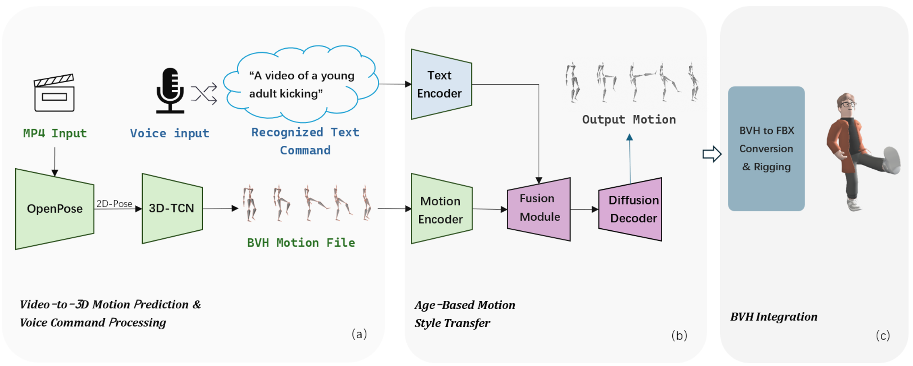

# 🧬 AgeStyle：基于年龄自适应的 VR 动作风格迁移系统

本仓库为 **AgeStyle: Dynamic Age-Adaptive Motion Transfer in Virtual Reality** 的开源示例资源，提供 Demo 平台（APK）、系统演示视频以及核心流程图。该系统结合深度学习与 VR 技术，实现不同年龄段动作风格的实时生成与沉浸式展示。

---

## 📱 VR Demo 平台（APK 下载）

本项目提供可直接安装到 VR 设备中的 Demo 平台，包含年龄预测、动作风格迁移与多视角交互体验等功能。

👉 **[点击下载 Demo 平台（APK）](platform/demo_platform.apk)**  
（将文件放置于 `platform/` 目录，VR 一体机可直接安装运行）

---

## 🎥 系统演示视频（Demo Video）

<video src="media/demo_video.mp4" controls="controls" width="70%">
  您的浏览器不支持 video 标签。
</video>

---

## 🧩 系统流程图（Pipeline）

系统整体流程展示如下：

---

## 📄 项目简介

AgeStyle 系统通过深度学习的视频动作解析与生成模型，将用户动作转换为不同年龄段（儿童、青年、中年、老年）的运动表现。  
核心特点包括：

### ⭐ 年龄自适应动作预测（Age-Adaptive Motion Prediction）
- 覆盖从儿童到老年的完整动作风格序列
- 支持顺向与逆向年龄变化的动作生成

### ⭐ 动态动作风格迁移（Motion Style Transfer）
- 输入用户实时动作，输出目标年龄段风格动作
- 多维度动作属性建模（速度、姿态、平衡等）

### ⭐ VR 沉浸式交互
- 支持第一人称、第三人称等自由视角
- 动态切换年龄段动作风格，实时可视化

系统适用于：  
教育、人机交互研究、康复训练、虚拟角色制作、动作学科科普等多类场景。

---

---

当前仓库仅包含 Demo 演示资源。  
**模型代码、数据处理管线与 VR 核心交互模块将在论文正式发表后开放。**

---

## 📚 Citation

如果您在研究中使用本项目，请引用以下论文：

**Feng Zhou, Chao Liu, Yiqing Huang, Ju Dai , Sen-Zhe X.**  
**AgeStyle: Dynamic Age-Adaptive Motion Transfer in Virtual Reality.**  
*Virtual Reality & Intelligent Hardware*, (), 1–13.

---

感谢关注 AgeStyle，我们将持续更新更多内容！
